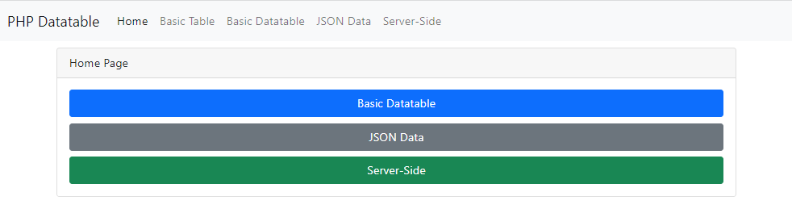
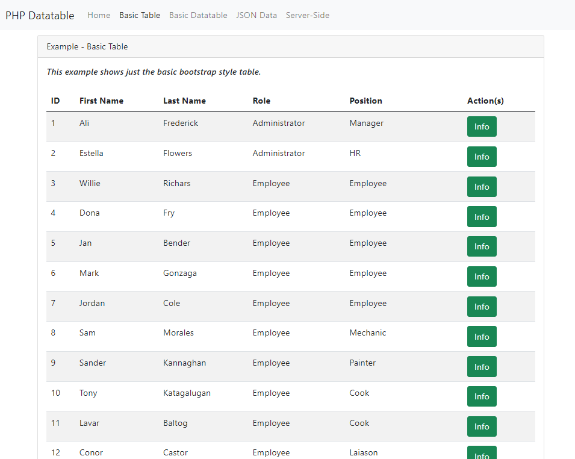
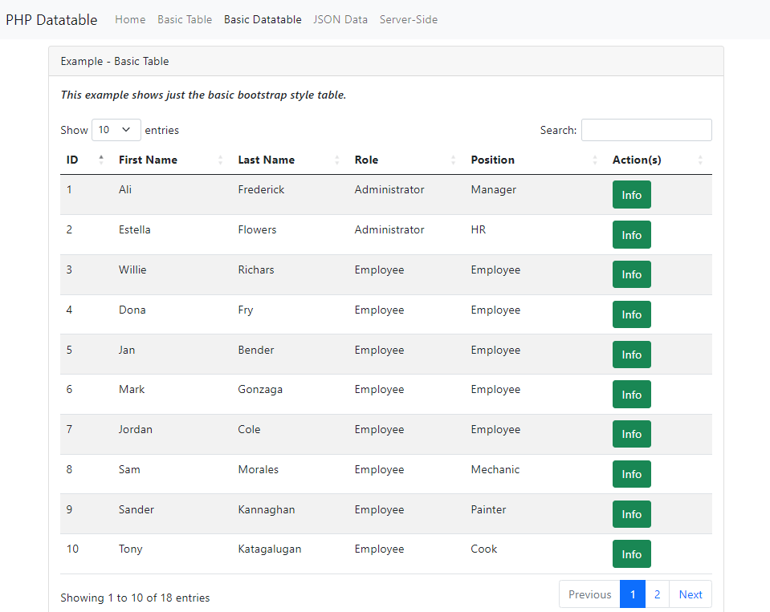

# PHP-PracticalExample-DataTables

- This is a practical example using Bootstrap 5 CSS, PHP, JQuery and JQuery Datatables. This is built using basic/native PHP also known Vanilla PHP.
- This is a PHP Web Example.
- This is an example to help students, junior developers and beginners to get use to PHP using datatables which is one of the mostly used plugin for displaying data records.
- This example assumes you already know how to clone, test and deploy your PHP web applications.

## Resources

- **Vanilla PHP** just means plain original PHP without any framework.

- [**Bootstrap 5**](https://getbootstrap.com/docs/5.0/getting-started/introduction/) is the newest version of Bootstrap, which is the most popular HTML, CSS, and JavaScript framework for creating responsive, mobile-first websites.

- [**jQuery**](https://jquery.com/) is a fast, small, and feature-rich JavaScript library. It makes things like HTML document traversal and manipulation, event handling, animation, and Ajax much simpler with an easy-to-use API that works across a multitude of browsers.

- [**jQuery DataTable**](https://datatables.net/) is a powerful and smart HTML table enhancing plugin provided by jQuery JavaScript library. [JQuery Bootstrap 5](https://datatables.net/examples/styling/bootstrap5.html) is used in this example.

## Screenshots







## Mocki

- Sample API link for [Employees](https://mocki.io/v1/1c9561cd-8dbc-4055-afaf-20261c34fd9f)

```php
$("#table_json").DataTable({
    processing: true,
    ajax: {
        url: "https://mocki.io/v1/1c9561cd-8dbc-4055-afaf-20261c34fd9f",
        type: "GET",
```

## Developer

- [Jerome Soriano](https://github.com/dvxgit-jsoriano)

*"Feel free to read, use, and apply to your projects."*